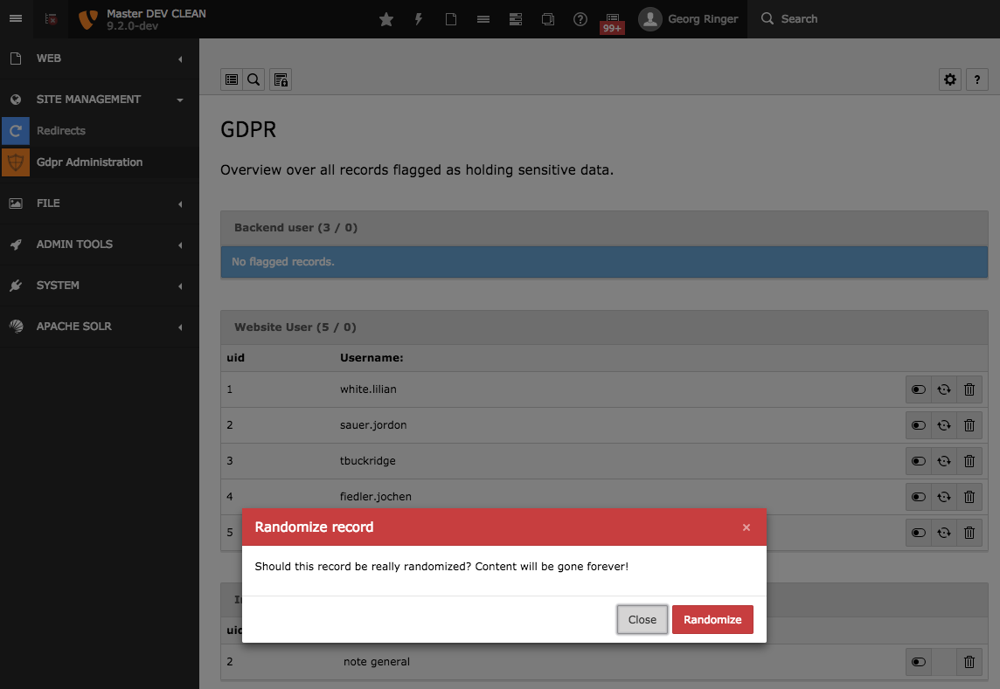
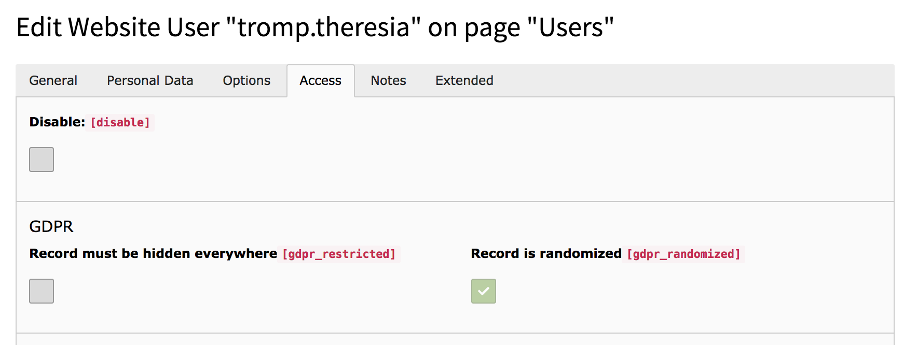
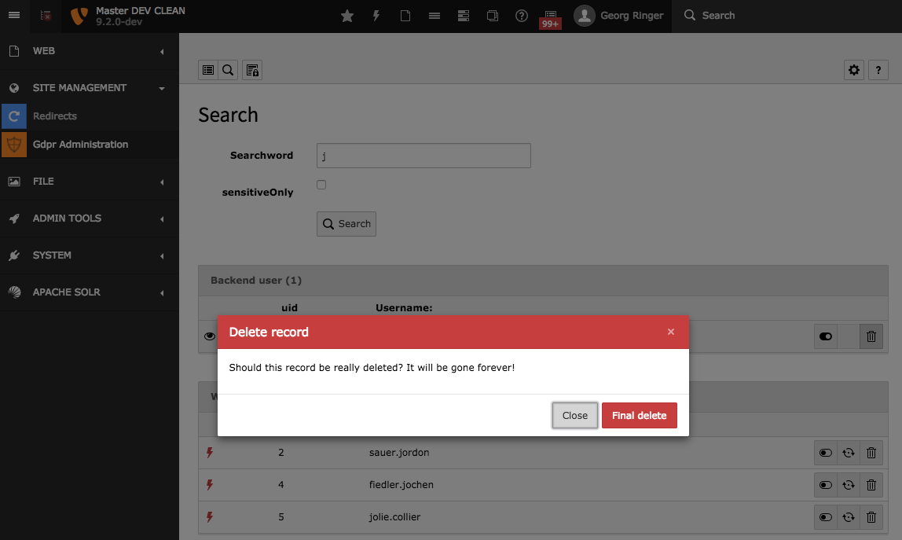
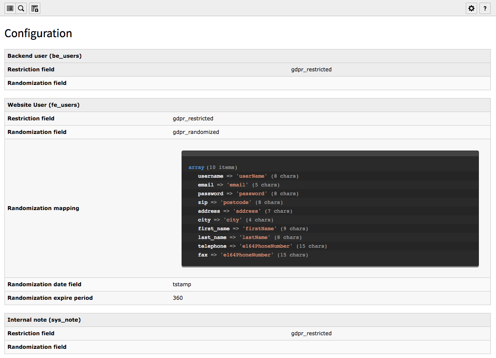
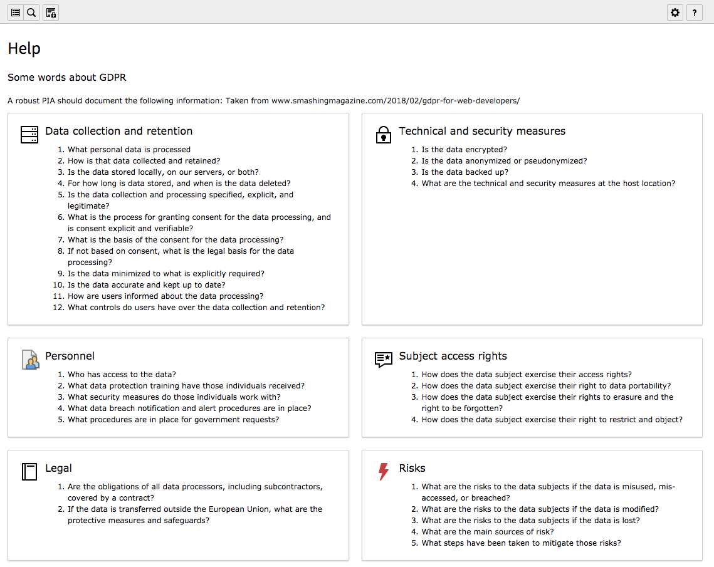

# TYPO3 Extension `gdpr`

[](https://www.paypal.me/GeorgRinger/19.99)
[](https://packagist.org/packages/georgringer/gdpr)


This extensions makes it easier for website owners and agencies to have the site compatible to the GDPR (German "DSGVO").

**Be aware** that this extension does **not** cover every area of the GDPR - especially the frontend part is **not** covered!







## Requirements

- TYPO3 CMS 9 LTS / 8
- **COMPOSER** currently required, at least for the randomization part

## Drawbacks

The limitation of the implementation is that only records having a TCA configuration are covered. 
Furthermore direct access to the database without using the `QueryBuilder` of TYPO3 will still deliver every record.

## Features

### Hide sensitive data

The General Data Protection Regulation requires that people can revoke access to their data. 
The extension makes it possible to exclude any record by activating a checkbox. After that, the record won't be accessible and available anymore, no matter if backend or frontend, editor or admin.

A new administration module gives editors the possibility to handle those flagged records and react with one of the following options:

- Completely remove the record from the database
- Reactivate the record
- Randomize content of the record (see below)

Every action regarding those flags is logged on a central place.

As additional security layer, this module must be explicitly enabled for every user - even for administrators.

### Randomize data

Records can be randomized by using the `fzaninotto/faker`. By providing a mapping per table, is possible to exchange the data with dummy information which looks still ok and can be used in exports. An example would be

```
Array
(
    [username] => martens.conny
    [email] => gerhild.hartwig@yahoo.de
    [password] => 94n3ifyp($+%u#
    [zip] => 33781
    [address] => Hans-Jürgen-Sauer-Weg 21
86788 Oberursel (Taunus)
    [city] => Pfungstadt
    [first_name] => Miriam
    [last_name] => Sander
    [telephone] => +8747861395322
    [fax] => +5484337015644
)
``` 

#### Using a CLI command

By using a CLI command, all data with a specific age can be randomized: `./web/typo3/sysext/core/bin/typo3 gdpr:randomize`

Result can look like this

```
Randomize data
==============

Starting with table "be_users"
------------------------------

 // Randomization skipped as not enabled!

Starting with table "fe_users"
------------------------------

 // find all fields where value of field "tstamp" is older than 360 days

 [OK] 3 records randomized

```

### Search

A search, similar to the one in the *DB Check* module allows to search within sensitive records.

### Logs

See and filter any action of GDPR related actions

### Anonymize IP logging

IPs inserted into the table `sys_log` and `index_stat_search` are now anonymized.

#### Anonymize existing data

By using a CLI command, existing IPs can be anonymized. Example:

```
# parameters: <tableName> <ipFieldName> <ageFieldName> <ageInDays>
./web/typo3/sysext/core/bin/typo3 gdpr:anonymizeIp sys_log tstamp IP 365
./web/typo3/sysext/core/bin/typo3 gdpr:anonymizeIp index_stat_search tstamp IP 180
```

### Report for report module

A report shows a short information about potential actions.

## Usage

1. Install the extension
2. Enable the users who are allowed to work with the module in the `be_users` table.
3. By default, the table `fe_users` is defined as the one having sensitive information, therefore there is a checkbox to hide this record.

### Add restriction to custom tables

Example call how an own record can be added.

```
$tca = \GeorgRinger\Gdpr\Service\Tca::getInstance('fe_users');
$tca
    ->addRestriction('gdpr_restricted')
    ->addRandomization('gdpr_randomized', [
        'dateField' => 'tstamp',
        'expirePeriod' => 360,
        'mapping' => [
            'username' => 'userName',
            'email' => 'email',
            'password' => 'password',
            'zip' => 'postcode',
            'address' => 'address',
            'city' => 'city',
            'first_name' => 'firstName',
            'last_name' => 'lastName',
            'telephone' => 'e164PhoneNumber',
            'fax' => 'e164PhoneNumber',
        ]
    ])
    ->add('after:disable');
```

## Technical background

The implementation is based on the `RestrictionContainers` of the TYPO3 core.
